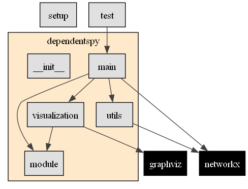

# `dependentspy`

`dependentspy` is another python dependency graph tool, focusing on visualizing project-internal imports.



## Installation

TODO

## Usage

```python
from dependentspy import dependentspy

G = dependentspy(
    "file/to/your/project",
    show_3rdparty=False,
    show_builtin=False,
    summarize_external=True,
    prune=True,
    use_clusters=True,
    use_nested_clusters=True,
    min_cluster_size=1,
    ignore=["drafts*"],
    hide=["main"],
    output_to_project=True,
    save_dot=True,
    render="if_changed",
    format="png",
)
G.view()
```

## Contributing

Pull requests are welcome. For major changes, please open an issue first
to discuss what you would like to change.

## License

[MIT](https://choosealicense.com/licenses/mit/)